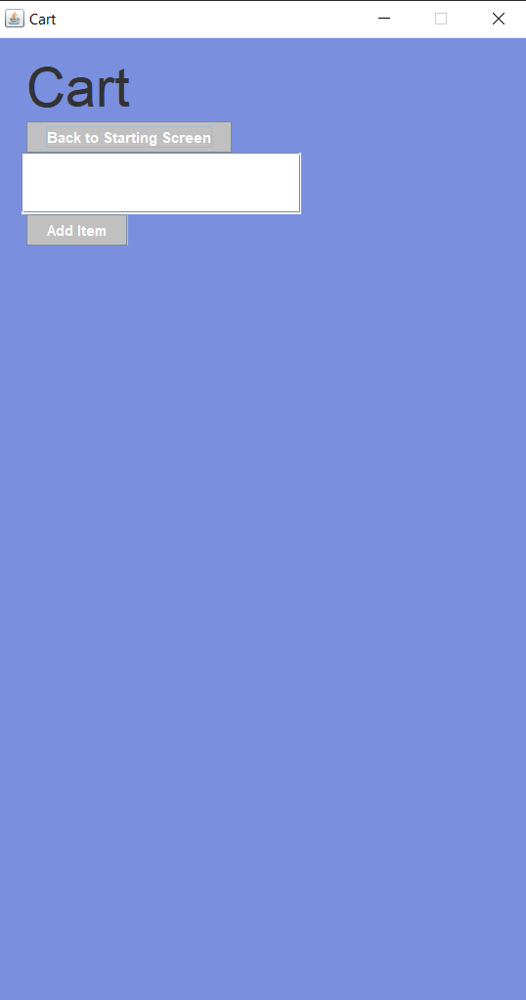
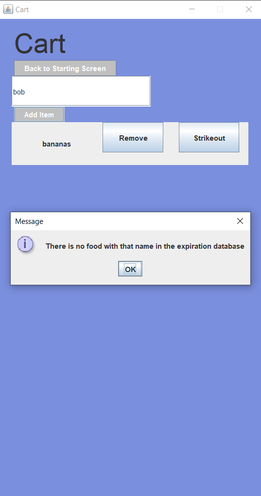
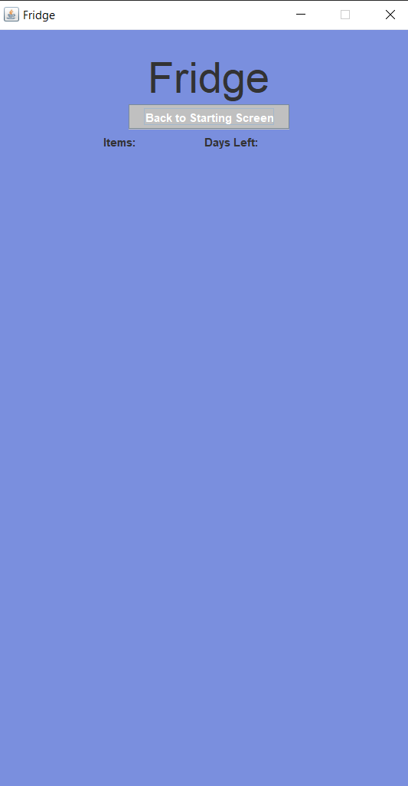
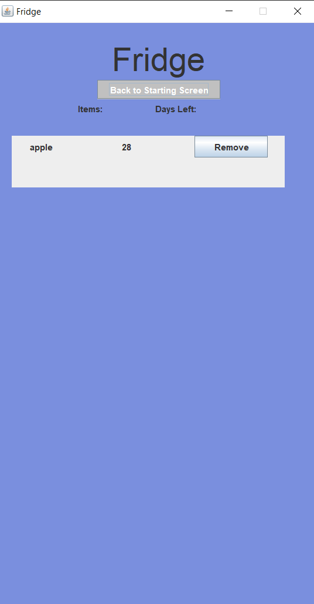

# shopping-cart-and-fridge-app
 GitHub for the Sporks Team during the Hack the Change Hackathon 2022

## About this project:
- This Java Swing application called Fridgey tracks how long food items have been in the fridge
- The goal of this project was to address one of the questions of the hackathon: How to promote healthy eating?
- The application has two main windows: The Cart and the Fridge

### Starting Menu:

### The Cart:
- Add food items to the Cart (based on those in the expiration database)
- Remove food items from the Cart
- Send food items to the Fridge to start their specialized countdown until expiration

#### Empty Cart:

#### Invalid Input:

### The Fridge:
- See the list of food items and days until expiry
- Remove items that have been eaten
- Stores items between uses

#### Empty Fridge:

#### Fridge with Item:

## Other:
- For all of us, this was our first hackathon. 
- As we decided to use Java for this project so we used its naming conventions.

## Java Conventions:
- Classes: UpperCamelCase (Ex: ImageSprite)
- Methods: lowerCamelCase (Ex: runProcess())
- Variables: lowerCamelCase (Ex: myVar)

## Branches:
- Everyone has their own branches
- Branches are limited in scope and should be pulled/merged quickly to the main
- Naming convention for branches: "developer_name"-"feature" Ex: yarik-fridge
